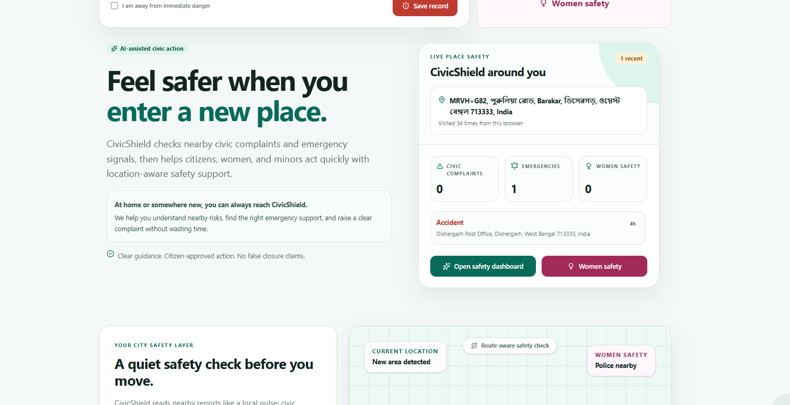

# CivicShield AI

**Location-aware civic safety for citizens, women, minors, and new-place visitors.**

CivicShield AI helps people understand nearby civic risks, raise structured complaints, find emergency support, and track public issues without navigating confusing government workflows.

> Built for a hackathon as a safety-first civic reporting platform. CivicShield does not replace police, ambulance, fire, or government emergency services. In immediate danger, users are directed to call **112**.



## Why CivicShield?

When someone enters an unfamiliar place, they usually do not know:

- whether civic complaints or emergencies were recently reported nearby,
- where the nearest police station, hospital, ambulance service, or fire station is,
- how to write a clear civic complaint,
- what to do first in a safety-critical situation.

CivicShield solves this by combining **live location**, **AI-assisted civic reporting**, **nearby safety infrastructure**, **public tracking**, and **moderator review** into one simple experience.

## Core Features

| Area | What It Does |
| --- | --- |
| **Live Place Safety** | Detects the user's location, identifies whether the area is familiar/new, and shows nearby civic complaints, emergencies, and women-safety signals from the last 24 hours. |
| **AI Civic Reports** | Turns plain-language user input into category, urgency, safety guidance, department routing, and a complaint-ready report. |
| **Emergency Help** | Prioritizes quick action with `Call 112`, emergency type selection, safety checklists, and nearby relevant help. |
| **Women Safety** | Shows nearby police stations, safer public places, and women-safety reporting entry points. |
| **Nearby Services** | Uses Google APIs and fallback open data to find police stations, hospitals, ambulance services, fire stations, and safer public places. |
| **Public Dashboard** | Shows complaints around the user's current location, report time, status, details, and public verification signals. |
| **Moderator Workspace** | Internal team panel for reviewing civic reports, emergency records, Civic Sense posts, status updates, false-report deletion, and Instagram review flow. |
| **Zero Civic Sense** | Floating social-awareness FAB where users can type, record voice, or record/upload 30-second video. AI generates captions and hashtags; moderators approve before posting. |
| **PWA Ready** | Installable mobile-first experience with icons, manifest, service worker, and responsive layouts. |

## User Journey

```text
User opens CivicShield
        |
        v
Location is requested once
        |
        +-- New/familiar place safety snapshot
        +-- Nearby complaints and emergency alerts
        +-- Quick paths: Report, Emergency, Women Safety

Civic issue
        -> Describe naturally
        -> Pin/confirm location
        -> AI creates structured report
        -> User approves complaint
        -> Public dashboard tracks status

Emergency
        -> Call 112 first
        -> Choose emergency type
        -> See nearby relevant departments
        -> Lodge short emergency record
        -> Nearby users see alerts for 24 hours

Zero Civic Sense
        -> Text / voice / 30 sec video
        -> AI caption + hashtags
        -> Moderator review
        -> Instagram publishing flow
```

## Highlighted Demo Paths

### 1. New Place Safety

The home dashboard checks the user's current area and shows:

- current location name,
- whether the user is new to that area,
- recent civic complaints nearby,
- recent emergency or women-safety signals,
- direct actions for dashboard and women safety.

### 2. Civic Complaint Creation

Users do not need to know official civic categories. They describe the issue naturally. CivicShield then:

- classifies the problem,
- detects urgency,
- gives immediate safety advice,
- suggests the nearest relevant department dynamically,
- drafts a complaint,
- saves it for tracking.

### 3. Emergency and Women Safety

Emergency UX is intentionally short:

- call `112`,
- share current location,
- select emergency type,
- see nearby police, hospitals, ambulances, fire stations, or safer public places,
- lodge a minimal emergency record.

Women-safety mode emphasizes nearby police stations and safer public locations.

### 4. Public Accountability

The public dashboard is location-scoped. Users can see reports around them, open detailed report pages, view lodged time, status timeline, and community verification signals.

### 5. Civic Sense Social Awareness

The floating **Zero Civic Sense** button lets users submit everyday public-awareness moments:

- text-only,
- voice recording,
- front/back camera video recording,
- media upload with 30-second video validation,
- auto location attachment.

The moderator sees the submission, generated caption, hashtags, media preview, and can approve, delete, reject, mark posted, or proceed with Instagram publishing when credentials are configured.

## Tech Stack

| Layer | Technology |
| --- | --- |
| Frontend | Next.js App Router, React, TypeScript |
| Styling | Tailwind CSS, custom public-service design system |
| AI | Groq API with deterministic fallback logic |
| Database | Supabase Postgres |
| Storage | Supabase Storage for Civic Sense media |
| Maps & Places | Google Geocoding / Places APIs with fallback open data |
| Email | Gmail OAuth owner sender |
| PWA | Web App Manifest, service worker, app icons |
| Deployment | Vercel-ready Next.js app |

## AI Usage

CivicShield uses AI for:

- civic issue classification,
- urgency and safety guidance,
- complaint drafting,
- department routing assistance,
- emergency alert prioritization,
- Civic Sense captions and hashtags.

AI is never treated as an emergency authority. Critical safety flows always put human action first.

## Important Routes

| Route | Purpose |
| --- | --- |
| `/` | Home, safety snapshot, quick actions, Zero Civic Sense FAB |
| `/report` | Civic complaint form |
| `/analysis/[reportId]` | AI analysis and complaint workflow |
| `/emergency` | Emergency and women-safety assistance |
| `/dashboard` | Location-scoped public issue dashboard |
| `/dashboard/[reportId]` | Public report detail and timeline |
| `/moderator` | Internal moderator workspace |


## Database Setup

Run the latest schema in Supabase SQL Editor:

```text
supabase/schema.sql
```

It creates the civic reports, status events, emergency reports, community verification, and Civic Sense submission tables.

## Run Locally

```bash
npm install
npm run dev
```

Open:

```text
http://localhost:3000
```

For checks:

```bash
npm run typecheck
```

## Privacy and Safety Boundary

- CivicShield does not claim that government departments or emergency services were contacted unless a configured delivery action succeeds.
- Moderator-only data stays behind a protected session.
- Public pages hide private evidence, raw emails, and sensitive internal details.
- Emergency records are shown as public safety signals, not official dispatch records.
- Civic Sense posts require moderator review before posting.

## Team

- **Dipayan Maji**
- **Kusal Laik**

## Hackathon Impact

CivicShield AI is built around one promise:

> **Whether you are at home or entering a new place, CivicShield helps you understand nearby risk and act quickly.**

It brings civic reporting, women safety, emergency awareness, public accountability, and social-awareness moderation into one location-first platform.
